### Descrição do Projeto

# Projeto desenvolvido para o desafio técnico de Auxiliar de Desenvolvimento Jr Frontend.

O objetivo foi criar uma interface para monitoramento de robôs RPA, permitindo visualizar:

- Lista de robôs
- Status do último resultado
- Data da última execução
- Detalhes do robô
- Histórico de execuções
- Logs das execuções

---

# Tecnologias Utilizadas

- React
- Vite
- React Router DOM
- Axios
- TailwindCSS

---

# Como Executar

## 1. Verifique se possui Python 3.10+

```bash
python --version
```

## 2. Execute o servidor da API

```bash
python servidor2.py
```

O arquivo pode ser obtido em:

https://github.com/Zalone03/ProjetoOeA/blob/main/servidor2.py

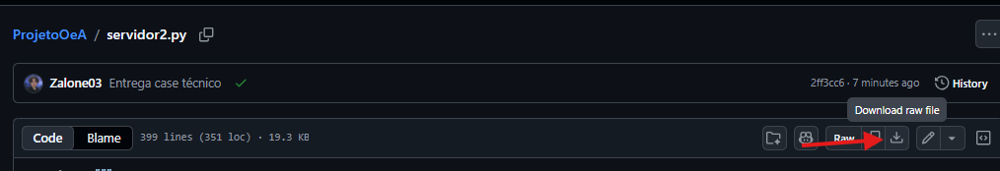

A API ficará disponível em:

```txt
http://localhost:8000
```

Os dados são fictícios e gerados na inicialização.

## 3. Acesse a aplicação

```txt
https://testerpa.netlify.app/
```

## 4. Permita o acesso ao localhost

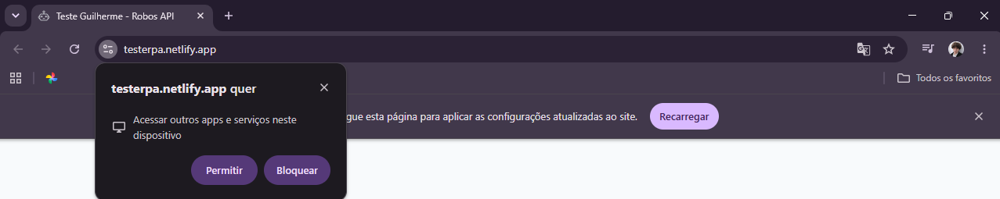

## 5. Utilize a aplicação

---

# Estrutura do Projeto

```txt
src
│
├── pages
│   ├── BotsPage
│   └── DetailsPage
│
├── components
│   ├── ui
│   └── ux
│
├── data
│   ├── api.js
│   ├── service.js
│   └── Routes.jsx
│
├── utils
│   └── filterBots.js
```

---

# Decisões Técnicas

## React + Vite

Escolhi React + Vite pela rapidez na configuração do projeto e pela agilidade do desenvolvimento.

## Axios

Utilizado para centralizar todas as chamadas da API em um único local.

Benefícios:

- manutenção simplificada
- reutilização de código
- melhor legibilidade

## TailwindCSS

Escolhi TailwindCSS para acelerar a construção da interface e manter os estilos organizados.

A abordagem baseada em utilitários facilitou ajustes rápidos de:

- responsividade
- espaçamento
- alinhamento
- aparência visual

---

# Planejamento da API

Antes da implementação, fiz um rascunho para entender melhor como organizar as chamadas HTTP utilizando Axios.

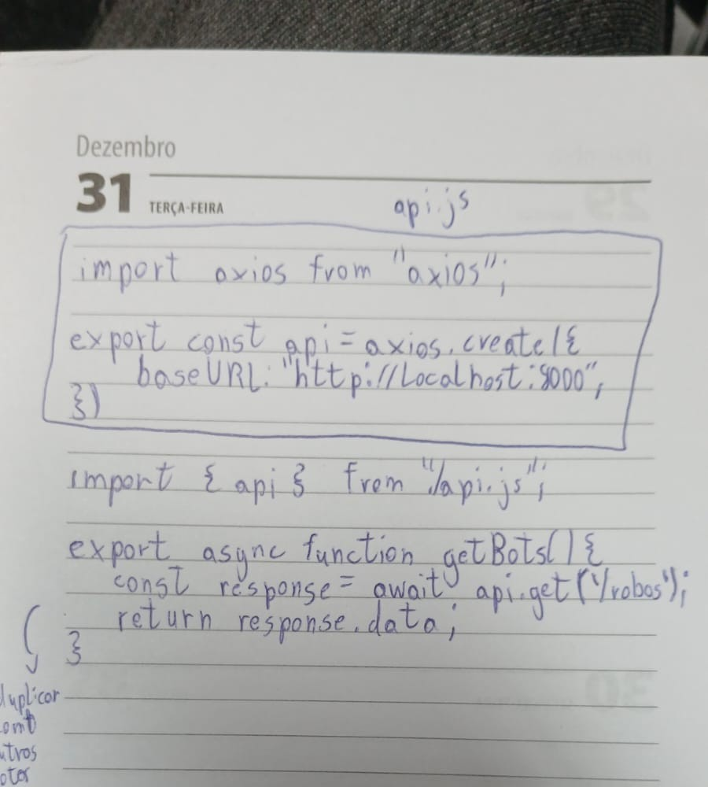

Nem toda a sintaxe estava correta inicialmente, mas esse planejamento ajudou a visualizar a estrutura antes da implementação.

Os ajustes foram realizados posteriormente durante o desenvolvimento utilizando documentação, pesquisas e ferramentas do VSCode.

---

# Primeiras Ideias da Interface

Na primeira conversa com Daniel, anotei informações sobre o funcionamento dos RPAs e sobre a necessidade de acompanhar:

- robôs
- execuções
- logs

Pesquisei um pouco mais sobre o tema para compreender melhor o contexto do desafio.

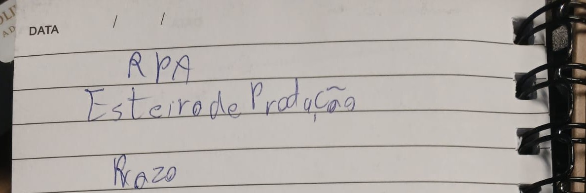

Esses rascunhos ajudaram a organizar as informações que deveriam aparecer na tela.

O objetivo foi criar uma interface simples para localizar robôs, visualizar execuções e consultar logs de forma rápida.

---

# Organização Inicial

Também realizei um rascunho da estrutura do projeto antes de iniciar a implementação.

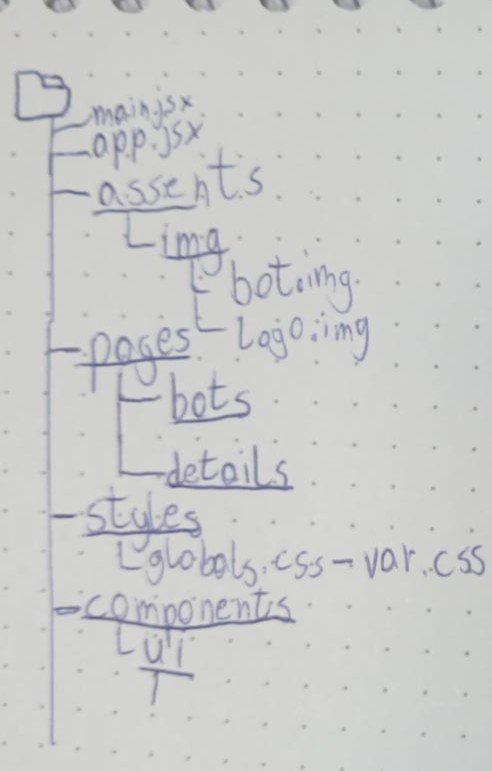

A estrutura evoluiu durante o desenvolvimento, mas serviu como base para organizar:

- páginas
- componentes
- serviços

Inicialmente considerei utilizar uma tabela, já que o desafio menciona uma listagem de robôs.

Durante os testes percebi que os cards facilitavam a identificação visual dos status e tornavam as informações mais separadas visualmente.

Por esse motivo optei por utilizar cards na tela principal.

---

# Dificuldades Encontradas

A principal dificuldade foi compreender a melhor forma de organizar:

- chamadas da API
- rotas
- componentes
- responsabilidades entre arquivos

Também tive dificuldades iniciais com React Router e com a distribuição das responsabilidades entre páginas e componentes.

Para resolver esses pontos utilizei:

- documentação oficial
- pesquisas na web
- ChatGPT
- Gemini

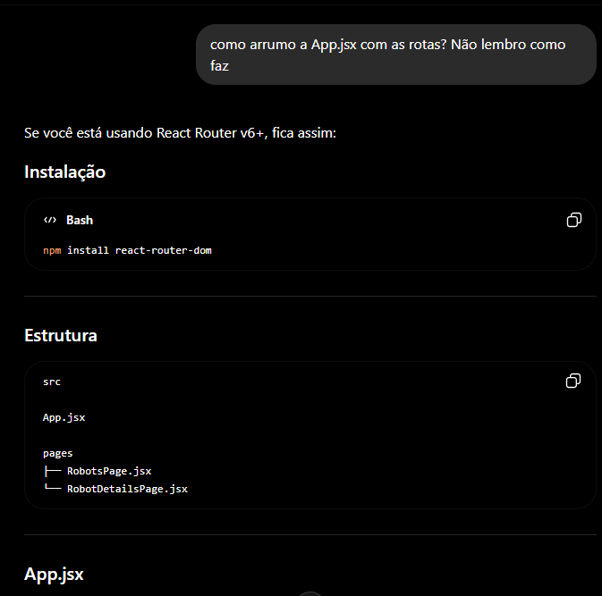

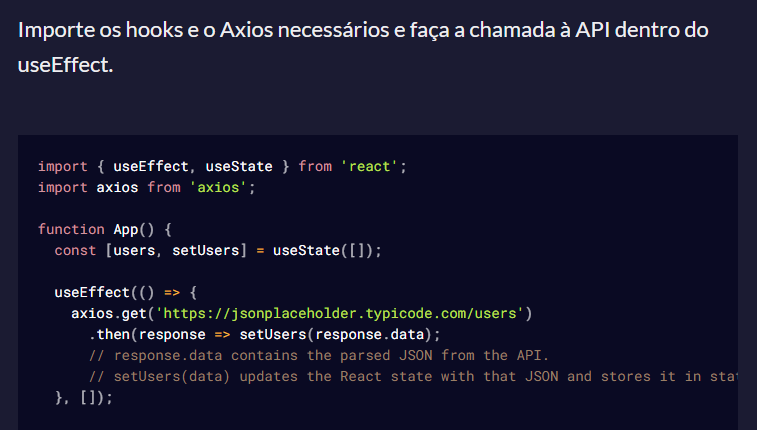

Outra dificuldade foi ajustar visualmente os indicadores de status para manter alinhamento consistente.

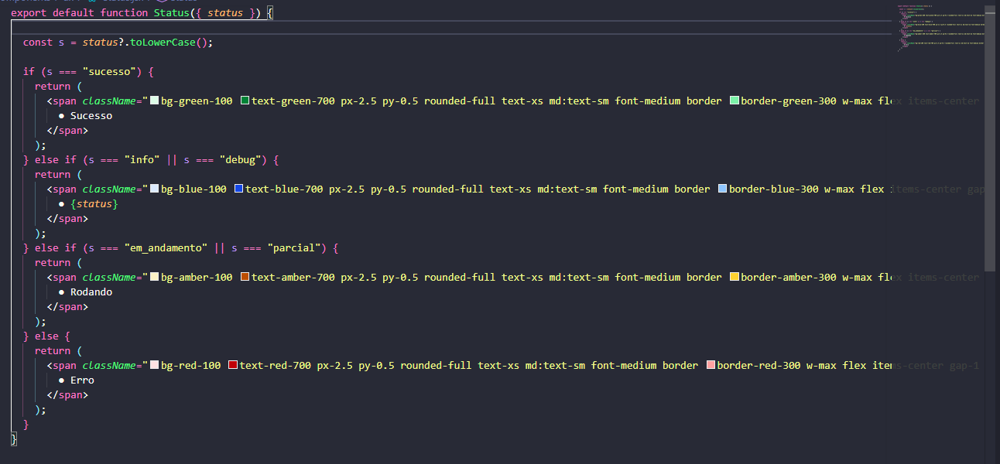

---

# Componentização

Outro desafio foi decidir quando criar um componente separado e quando manter a lógica dentro da própria página.

Durante o desenvolvimento algumas partes foram refatoradas para componentes específicos:

- CardBot
- ExecutionList
- ExecutionItem
- LogsList
- RobotInfo

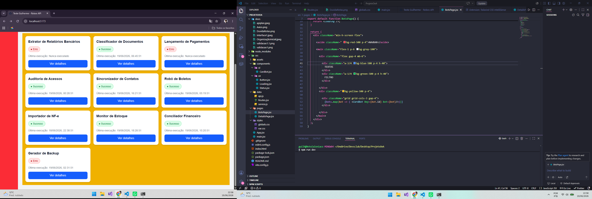

Essa separação deixou o código mais reutilizável e mais fácil de manter.

---

# Organização das Camadas

Para organizar o projeto utilizei uma divisão simples entre responsabilidades.

## data

Responsável pelas chamadas HTTP.

## pages

Responsável pela composição das telas.

## components/ui

Componentes relacionados aos dados da aplicação.

## components/ux

Componentes reutilizáveis de interface.

## utils

Funções auxiliares reutilizáveis.

Essa organização ajudou a evitar que componentes de interface precisassem conhecer detalhes de implementação da API.

---

# Ajustes e Validações

Durante o desenvolvimento realizei diversos testes para validar:

- comunicação com a API
- alinhamentos
- responsividade
- legibilidade
- comportamento dos status

Primeira validação da comunicação entre React e API:

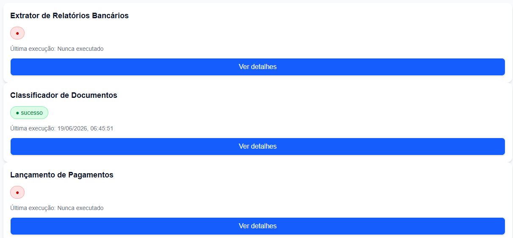

Nesse momento o objetivo era garantir que os dados estavam chegando corretamente.

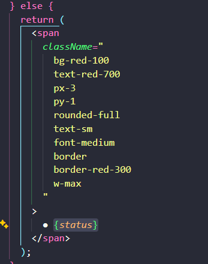

Posteriormente realizei ajustes de:

- tipografia
- espaçamento
- organização visual

Também modifiquei temporariamente o servidor para gerar uma quantidade maior de robôs e validar o comportamento da interface.

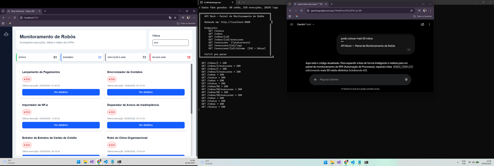

Evolução da segunda tela:

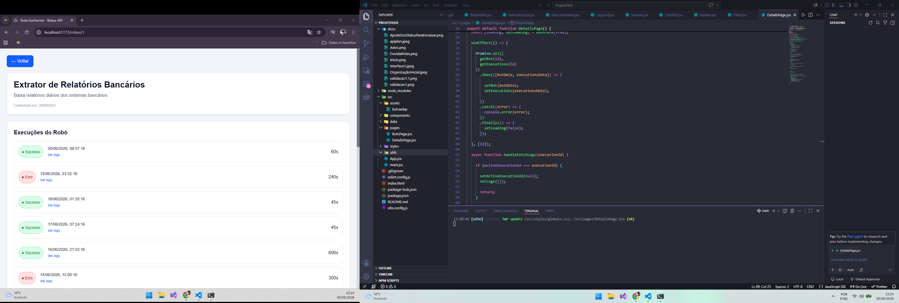

---

# Resultado Final

## Tela Principal

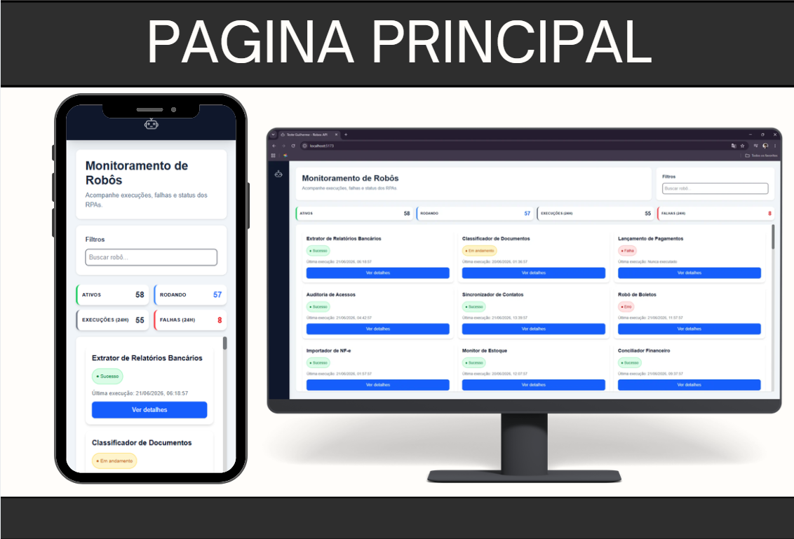

## Tela de Detalhes

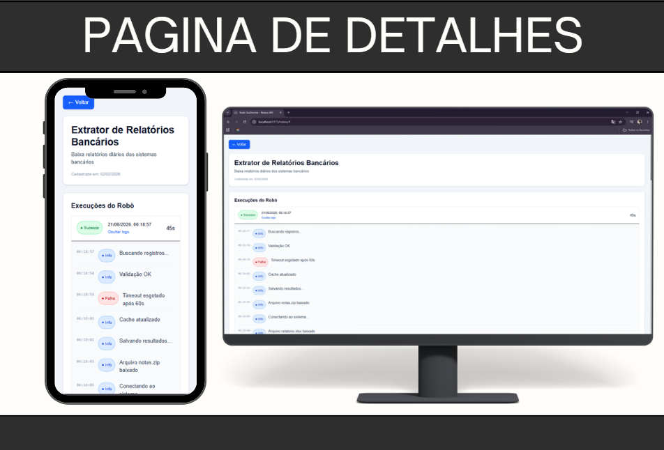

---

# Uso de Inteligência Artificial

Durante o desenvolvimento utilizei ChatGPT e Gemini como ferramentas de apoio técnico.

Principais usos:

- esclarecimento de dúvidas de sintaxe
- auxílio com React Router
- sugestões de componentização
- discussão de alternativas de arquitetura
- apoio na interpretação de erros
- sugestões de responsividade

Exemplos:

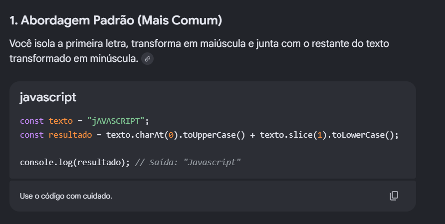

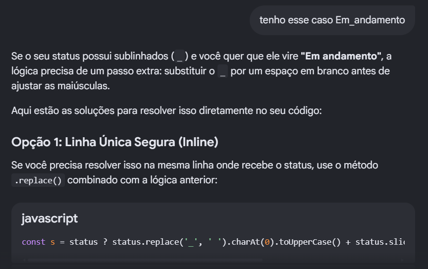

As respostas não foram copiadas diretamente para produção sem validação.

Todas as sugestões foram analisadas e testadas antes de serem incorporadas ao projeto.

---

# Fontes de Estudo Utilizadas

Além da IA, também utilizei documentações, pesquisas e livros para validar informações:

- Eloquent JavaScript: A Modern Introduction to Programming
- The Road to Learn React
- tailwindcss.com
- freecodecamp.org
- circleci.com
- kufunda.net/publicdocs/

---

# Funcionalidades Implementadas

## Página Principal

- Listagem dos robôs
- Status da última execução
- Data da última execução
- Navegação para detalhes
- Indicadores visuais de status
- Cards responsivos

## Página de Detalhes

- Dados completos do robô
- Histórico de execuções
- Consulta de logs sob demanda
- Retorno para página principal

## Bônus Implementados

- Busca por nome e status
- Layout responsivo para dispositivos móveis

---

# Melhorias Futuras de Limitações 

Caso o projeto continuasse evoluindo, eu adicionaria:

- filtros avançados por status
- tema escuro
- priorização de robôs com falha
- gráficos de acompanhamento
- notificações de falhas
- tratamento visual para erros capturados
---

# Aprendizados

Durante o desenvolvimento reforcei conhecimentos e identifiquei pontos nos quais ainda pretendo me aprofundar:

- React Router
- Componentização
- Consumo de APIs REST
- Axios
- Organização de projetos React
- TailwindCSS